# 🚀 ArgoCD 설정 가이드

SearchPilot 프로젝트의 ArgoCD 기반 자동 배포 설정 가이드입니다.

## 📋 목차

1. [ArgoCD 설치](#argocd-설치)
2. [로컬 Kubernetes 환경 구성](#로컬-kubernetes-환경-구성)
3. [ArgoCD 애플리케이션 등록](#argocd-애플리케이션-등록)
4. [배포 확인](#배포-확인)

---

## 🔧 ArgoCD 설치

### 1️⃣ ArgoCD 설치 (Kubernetes)

```bash
# ArgoCD 네임스페이스 생성
kubectl create namespace argocd

# ArgoCD 설치
kubectl apply -n argocd -f https://raw.githubusercontent.com/argoproj/argo-cd/stable/manifests/install.yaml

# ArgoCD 서버 준비 대기
kubectl wait --for=condition=available --timeout=300s deployment/argocd-server -n argocd
```

### 2️⃣ ArgoCD CLI 설치

**macOS:**
```bash
brew install argocd
```

**Linux:**
```bash
curl -sSL -o argocd-linux-amd64 https://github.com/argoproj/argo-cd/releases/latest/download/argocd-linux-amd64
sudo install -m 555 argocd-linux-amd64 /usr/local/bin/argocd
rm argocd-linux-amd64
```

**Windows:**
- [ArgoCD CLI 다운로드](https://argo-cd.readthedocs.io/en/stable/cli_installation/)

### 3️⃣ ArgoCD 접속

```bash
# 포트포워딩 (백그라운드)
kubectl port-forward svc/argocd-server -n argocd 8080:443 &

# 초기 패스워드 확인
kubectl -n argocd get secret argocd-initial-admin-secret -o jsonpath="{.data.password}" | base64 -d
```

**접속 정보:**
- URL: https://localhost:8080
- Username: `admin`
- Password: 위 명령어로 확인한 패스워드

---

## 🏗️ 로컬 Kubernetes 환경 구성

### 1️⃣ Kubernetes 클러스터 확인

```bash
# 클러스터 상태 확인
kubectl cluster-info

# 노드 상태 확인
kubectl get nodes
```

### 2️⃣ SearchPilot 네임스페이스 생성

```bash
# 네임스페이스 생성
kubectl apply -f k8s/namespace.yaml
```

---

## 📱 ArgoCD 애플리케이션 등록

### 1️⃣ 자동 등록 (권장)

```bash
# SearchPilot 애플리케이션 자동 등록
kubectl apply -f k8s/argocd-application.yaml
```

### 2️⃣ 수동 등록 (ArgoCD UI)

1. ArgoCD UI 접속 (https://localhost:8080)
2. **"NEW APP"** 클릭
3. 애플리케이션 정보 입력:
   - **Application Name**: `searchpilot`
   - **Project**: `default`
   - **Sync Policy**: `Automatic`
   - **Repository URL**: `https://github.com/xxng1/searchpilot`
   - **Path**: `k8s`
   - **Cluster URL**: `https://kubernetes.default.svc`
   - **Namespace**: `searchpilot`

---

## 🔄 CI/CD 파이프라인 동작

### 1️⃣ CI 파이프라인 (`.github/workflows/ci.yml`)

```mermaid
graph LR
    A[코드 푸시] --> B[테스트 실행]
    B --> C[Docker 이미지 빌드]
    C --> D[GHCR 푸시]
```



### 2️⃣ CD 파이프라인 (`.github/workflows/cd.yml`)

```mermaid
graph LR
    A[CI 완료] --> B[ArgoCD 트리거]
    B --> C[자동 동기화]
    C --> D[Kubernetes 배포]
```



### 3️⃣ ArgoCD 동기화

- **자동 감지**: 새로운 이미지 태그 감지
- **Auto-Sync**: 자동으로 Kubernetes에 배포
- **Self-Heal**: 수동 변경사항 자동 복구
- **Prune**: 불필요한 리소스 자동 삭제

---

## 📊 배포 확인

### 1️⃣ ArgoCD UI에서 확인

1. https://localhost:8080 접속
2. `searchpilot` 애플리케이션 클릭
3. 배포 상태 및 리소스 확인

### 2️⃣ kubectl로 확인

```bash
# 네임스페이스 확인
kubectl get namespaces

# SearchPilot 리소스 확인
kubectl get all -n searchpilot

# Pod 상태 확인
kubectl get pods -n searchpilot

# 서비스 확인
kubectl get services -n searchpilot
```

### 3️⃣ 애플리케이션 접속

```bash
# Frontend 포트포워딩
kubectl port-forward svc/frontend -n searchpilot 3000:3000

# Backend 포트포워딩
kubectl port-forward svc/backend -n searchpilot 8000:8000
```

**접속 URL:**
- Frontend: http://localhost:3000
- Backend API: http://localhost:8000
- Backend Docs: http://localhost:8000/docs

---

## 🔧 트러블슈팅

### 1️⃣ ArgoCD 접속 문제

```bash
# ArgoCD 서버 상태 확인
kubectl get pods -n argocd

# 로그 확인
kubectl logs -n argocd deployment/argocd-server
```

### 2️⃣ 배포 실패

```bash
# 애플리케이션 상태 확인
kubectl describe application searchpilot -n argocd

# 이벤트 확인
kubectl get events -n searchpilot --sort-by='.lastTimestamp'
```

### 3️⃣ 이미지 Pull 실패

```bash
# 이미지 확인
docker pull ghcr.io/xxng1/searchpilot/backend:latest

# 이미지 태그 업데이트
kubectl set image deployment/backend backend=ghcr.io/xxng1/searchpilot/backend:latest -n searchpilot
```

---

## 📚 참고 자료

- [ArgoCD 공식 문서](https://argo-cd.readthedocs.io/)
- [ArgoCD Best Practices](https://argo-cd.readthedocs.io/en/stable/operator-manual/)
- [Kubernetes 공식 문서](https://kubernetes.io/docs/)
- [GitHub Container Registry](https://docs.github.com/en/packages/working-with-a-github-packages-registry/working-with-the-container-registry)

---

## 🎯 다음 단계

1. ✅ ArgoCD 설치 및 설정
2. ✅ CI/CD 파이프라인 분리
3. 🔄 로컬 Kubernetes 환경 구성
4. 🔄 ArgoCD 애플리케이션 등록
5. 🔄 자동 배포 테스트

**Happy Deploying! 🚀**
